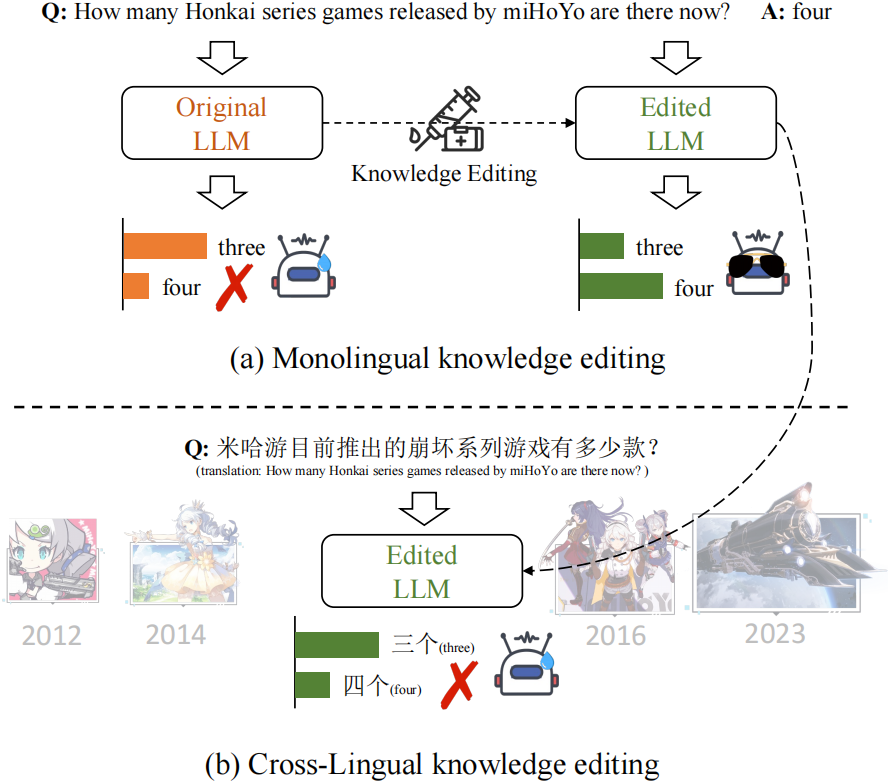

<div align="center">
<h1>
Bi-ZsRE
</h1>
</div>

This repository contains the data and codes for our paper "[Cross-Lingual Knowledge Editing in Large Language Models](https://arxiv.org/abs/2309.08952)".

### Quick Links
- [1. Overview](#1-overview)
- [2. Bi-ZsRE](#2-bi-zsre)
- [3. Codes](#3-codes)
    - [3.1 ROME](#31-rome)
    - [3.2 MEMIT](#32-memit)
    - [3.3 KN](#33-kn)
    - [3.4 Others](#34-others)
- [4. Evaluation](#4-evaluation)
    - [4.1 How to Evaluate](#41-how-to-evaluate)
    - [4.2 Results](#42-results)
- [Acknowledgement](#acknowledgement)
- [Citation](#citation)

### 1. Overview

In this work, we explore the effect of source language editing on a different target language. For example, when we use English samples to edit a multi-lingual large language model, can the model reflect consistent behaviors when faced with a different target language?

<p align="center">
    <br>
    
    <br>
</p>

### 2. Bi-ZsRE

**Summary**: Bi-ZsRE translates the editing samples of ZsRE from English into Chinese. 

**Detail**: The orginal ZsRE dataset ([Levy et al., 2017](https://aclanthology.org/K17-1034/)) is a Question Answering (QA) dataset whose queries require models to answer the questions based on the information within the queries. More recently, based on ZsRE, [Yao et al. (2023)](https://arxiv.org/abs/2305.13172) provide a test set with 1,037 samples for a more comprehensive evaluation of knowledge editing, where each test sample additionally contains a QA pair to assess LLMs’ portability to reason based on the edited fact. Here, we translate the ZsRE samples as well as the portability QA pairs provided by Yao et al. (2023), and follow the data splitting of Yao et al. (2023).

**Resource**: You can download Bi-ZsRE data from the [share link](https://drive.google.com/file/d/1Dw2q-oIUWoV1CvUl5q3CBaD0JIV9jtn0). All files are described as follows:

- `zsre_mend_train_10000.json`: The original ZsRE English training samples
- `zsre_mend_train_10000_chinese.json`: The translated Chinese samples
- `zsre_mend_eval.json`: The original ZsRE English dev samples
- `zsre_mend_eval_chinese.json`: The translated Chinese samples.
- `bizsre_test.json`: The original English samples as well as translated Chinese samples.

Among them, `zsre_mend_train_10000.json`, `zsre_mend_eval.json` and the English part of `bizsre_test.json` are originally provided by [EasyEdit](https://github.com/zjunlp/EasyEdit#current-implementation). 

## 3. Codes

Our codes are based on [EasyEdit](https://github.com/zjunlp/EasyEdit), and slightly change some functions to adapt to the cross-lingual evaluation.

Before running the following codes, make sure to set MODEL PATH in the corresponding config files (every `.yaml` file in `hparams` folder).

#### 3.1 ROME
Editing Chinese LLaMA with English samples:
```
CUDA_VISIBLE_DEVICES=<gpu> python run_bizsre.py --editing_method=ROME --hparams_dir=hparams/ROME/llama-7b --data_dir=data --source_lang en
```
Editing Chinese LLaMA with Chinese samples:
```
CUDA_VISIBLE_DEVICES=<gpu> python run_bizsre.py --editing_method=ROME --hparams_dir=hparams/ROME/llama-7b --data_dir=data --source_lang zh
```
Editing Chinese LLaMA2 with English samples:
```
CUDA_VISIBLE_DEVICES=<gpu> python run_bizsre.py --editing_method=ROME --hparams_dir=hparams/ROME/llama2-7b --data_dir=data --source_lang en --backbone chinese_llama2_7b
```
Editing Chinese LLaMA2 with Chinese samples:
```
CUDA_VISIBLE_DEVICES=<gpu> python run_bizsre.py --editing_method=ROME --hparams_dir=hparams/ROME/llama2-7b --data_dir=data --source_lang zh --backbone chinese_llama2_7b
```
Editing BaiChuan with English samples:
```
CUDA_VISIBLE_DEVICES=<gpu> python run_bizsre.py --editing_method=ROME --hparams_dir=hparams/ROME/baichuan-7b --data_dir=data --source_lang en --backbone baichuan7b
```
Editing BaiChuan with Chinese samples:
```
CUDA_VISIBLE_DEVICES=<gpu> python run_bizsre.py --editing_method=ROME --hparams_dir=hparams/ROME/baichuan-7b --data_dir=data --source_lang zh --backbone baichuan7b
```

#### 3.2 MEMIT

Editing Chinese LLaMA with English samples:
```
CUDA_VISIBLE_DEVICES=<gpu> python run_bizsre.py --editing_method=MEMIT --hparams_dir=hparams/MEMIT/llama-7b --data_dir=data --source_lang en
```
Editing Chinese LLaMA with Chinese samples:
```
CUDA_VISIBLE_DEVICES=<gpu> python run_bizsre.py --editing_method=MEMIT --hparams_dir=hparams/MEMIT/llama-7b --data_dir=data --source_lang zh
```
Editing Chinese LLaMA2 with English samples:
```
CUDA_VISIBLE_DEVICES=<gpu> python run_bizsre.py --editing_method=MEMIT --hparams_dir=hparams/MEMIT/llama2-7b --data_dir=data --source_lang en --backbone chinese_llama2_7b
```
Editing Chinese LLaMA2 with Chinese samples:
```
CUDA_VISIBLE_DEVICES=<gpu> python run_bizsre.py --editing_method=MEMIT --hparams_dir=hparams/MEMIT/llama2-7b --data_dir=data --source_lang zh --backbone chinese_llama2_7b
```
Editing BaiChuan with English samples:
```
CUDA_VISIBLE_DEVICES=<gpu> python run_bizsre.py --editing_method=MEMIT --hparams_dir=hparams/MEMIT/baichuan-7b --data_dir=data --source_lang en --backbone baichuan7b
```
Editing BaiChuan with Chinese samples:
```
CUDA_VISIBLE_DEVICES=<gpu> python run_bizsre.py --editing_method=MEMIT --hparams_dir=hparams/MEMIT/baichuan-7b --data_dir=data --source_lang zh --backbone baichuan7b
```


#### 3.3 KN
Editing Chinese LLaMA with English samples:
```
CUDA_VISIBLE_DEVICES=<gpu> python run_bizsre.py --editing_method=KN --hparams_dir=hparams/KN/llama-7b --data_dir=data --source_lang en
```
Editing Chinese LLaMA with Chinese samples:
```
CUDA_VISIBLE_DEVICES=<gpu> python run_bizsre.py --editing_method=KN --hparams_dir=hparams/KN/llama-7b --data_dir=data --source_lang zh
```
Editing Chinese LLaMA2 with English samples:
```
CUDA_VISIBLE_DEVICES=<gpu> python run_bizsre.py --editing_method=KN --hparams_dir=hparams/KN/llama2-7b --data_dir=data --source_lang en --backbone chinese_llama2_7b
```
Editing Chinese LLaMA2 with Chinese samples:
```
CUDA_VISIBLE_DEVICES=<gpu> python run_bizsre.py --editing_method=KN --hparams_dir=hparams/KN/llama2-7b --data_dir=data --source_lang zh --backbone chinese_llama2_7b
```
Editing BaiChuan with English samples:
```
CUDA_VISIBLE_DEVICES=<gpu> python run_bizsre.py --editing_method=KN --hparams_dir=hparams/KN/baichuan-7b --data_dir=data --source_lang en --backbone baichuan7b
```
Editing BaiChuan with Chinese samples:
```
CUDA_VISIBLE_DEVICES=<gpu> python run_bizsre.py --editing_method=KN --hparams_dir=hparams/KN/baichuan-7b --data_dir=data --source_lang zh --backbone baichuan7b
```

#### 3.4 Others
ROME, MEMIT and KN are three locate-then-edit knowledge editing methods that do not need additional training. For other methods, you should first train the model with `zsre_mend_train_10000.json` or `zsre_mend_train_10000_chinese.json`, and then perform the model on the test set.

For the training codes, please refer to `train.py`.


## 4. How to Evaluate?
After running the codes, model results will be generated in the `results/` folder in the format of `{BACKBONE_NAME}_{METHOD_NAME}_{DIRECTION}_results.json`.

- BACKBONE_NAME: `baichuan7b`, `cinese_llama7b` or `chinese_llama2_7b`
- METHOD_NAME: `ROME`, `MEMIT`, `KN`, `SERAC`, `IKE`, `MEND`
- DIRECTION: `en_zh` (the model is edited in English samples and test on all samples) or `zh_en` (the model is edited in Chinese samples and test on all)

For our evaluation code, please refer to `evaluate.py`:
```python
from evaluate import calculate_metrics
calculate_metrics("results/baichuan7b_ROME_en_zh_results.json")
```
(using results of English-edited BaiChuan-7B via ROME as an example)


### Acknowledgement
- Our codes are based on [EasyEdit](https://github.com/zjunlp/EasyEdit), and we thank their outstanding open-source contributions.
- Our data is based on vanilla ZsRE dataset ([Levy et al., 2017](https://aclanthology.org/K17-1034/)) and the portability QA pairs collect by [Yao et al. (2023)](https://arxiv.org/abs/2305.13172).
    - [Zero-Shot Relation Extraction via Reading Comprehension](https://aclanthology.org/K17-1034/) (CoNLL 2017)
    - [Editing Large Language Models: Problems, Methods, and Opportunities](https://arxiv.org/abs/2305.13172) (arXiv preprint 2023)

### Citation
If you find this work is useful or use the data in your work, please consider cite our paper:
```
@article{wang2023cross,
  title={Cross-Lingual Knowledge Editing in Large Language Models},
  author={Wang, Jiaan and Liang, Yunlong and Sun, Zengkui and Cao, Yuxuan and Xu, Jiarong},
  journal={arXiv preprint arXiv:2309.08952},
  year={2023}
}
```
We also recommend citing the vanilla ZsRE dataset and Yao et al. (2023):
```
@inproceedings{levy-etal-2017-zero,
    title = "Zero-Shot Relation Extraction via Reading Comprehension",
    author = "Levy, Omer  and
      Seo, Minjoon  and
      Choi, Eunsol  and
      Zettlemoyer, Luke",
    booktitle = "Proceedings of the 21st Conference on Computational Natural Language Learning ({C}o{NLL} 2017)",
    month = aug,
    year = "2017",
    address = "Vancouver, Canada",
    publisher = "Association for Computational Linguistics",
    url = "https://aclanthology.org/K17-1034",
    doi = "10.18653/v1/K17-1034",
    pages = "333--342"
}

@article{yao2023editing,
  title={Editing Large Language Models: Problems, Methods, and Opportunities},
  author={Yao, Yunzhi and Wang, Peng and Tian, Bozhong and Cheng, Siyuan and Li, Zhoubo and Deng, Shumin and Chen, Huajun and Zhang, Ningyu},
  journal={arXiv preprint arXiv:2305.13172},
  year={2023}
}
```